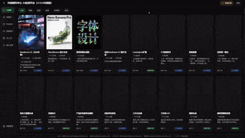
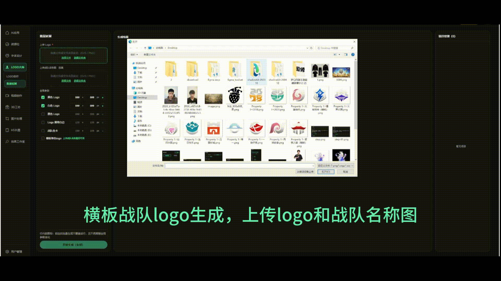

# ShadowKitAI - 赛事美术AI工具聚合平台功能展示（部分）

赛事美术方向 AIGC 工具聚合平台：工作流卡片、海报编辑、字体设计等能力的前端应用。

---

## 🏠 首页概览

清晰的功能入口布局，所有核心工具一目了然，快速直达所需模块。

---

## ✨ 功能预览

### 🖌️ 字体设计 — 运营活动标题一键生成

选风格 → 输入文本 → 生成结果，告别绞尽脑汁写提示词，套用模板直接生成。

 

### 📊 资源位 — 一键智能匹配资源位

一键智能匹配资源位，降低手工调整成本，提升出图效率与稳定性。在多资源位批量处理场景下，相较于传统出图方式，整体反馈速度和交付节奏更友好，适合日常高频运营需求。

 

### 📇 分镜助手 — 剧本镜头智能拆分、批量视频生成

AI 导演讲戏提供节奏、素材建议，智能拆分、润色镜头脚本，提升短剧叙事可控性。

- 镜头脚本可自由二次编辑、增加、删减，多种自定义参数
- 联动角色库功能，一键添加角色、场景素材，让视频创作更轻松
- 一键批量提交视频任务，不满意重新提交
- 视频文件自动规范命名，关联镜头编号与内容标题
- 可新建多个分镜项目，轻松创作、管理连载剧集

  

### 📇 H5 长图 — 活动长图模板一键套用

支持渠道模板选择与自定义编辑，超简单交互完成活动长图制作。已上线华为渠道重磅更新模板，多种参数可调节，更多模板持续更新中。

### ✨ 效果工作室 — 静态图一键生成渠道动效素材

新增「效果工作室」入口，支持上传图片后快速添加动效，并导出符合渠道规范的 GIF 素材。

- 支持单图模式与多图层模式，多图层可拖拽、缩放、旋转
- 内置渠道导出规格，自动处理尺寸、帧数、时长、圆角、边框与大小限制
- OPPO 支持视频底片预览，可更直观看到渠道展示效果
- **使用场景**：渠道资源位 GIF 图片指定文件大小与尺寸压缩导出

### 🎯 Logo 大师 — 批量延展

新增「Logo 大师」批量延展，支持一次配置多尺寸规格，自动导出适配的延展资源，打包下载，文件名自动规范命名分类文件夹。支持项目管理，方便对比与二次编辑。

 

### 🖼️ 图片处理 — 更多图像编辑能力

提供便捷的图片处理功能，满足日常图像编辑需求。

---
